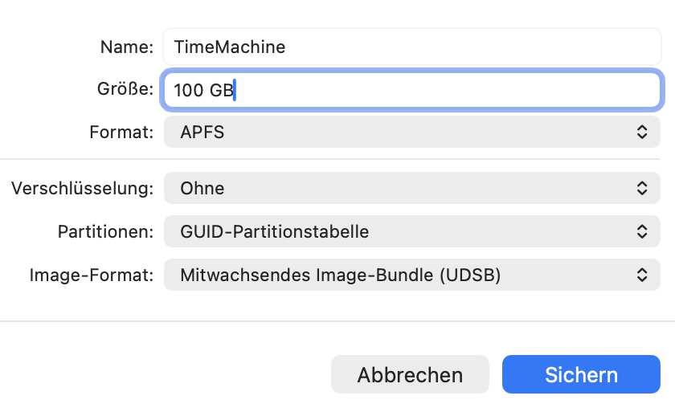

Hi everyone, welcome to my first post this year. 

# Create sparse image (virtual disk)
There are two ways to create this virtual disk - via commands in the terminal or via the Disk Utility App (GUI)

### Terminal way
Go into the folder where you want to create the virtual disk (NOT THE SMB SHARE, this step comes later).
In this case, I'm using my Desktop:

```bash
cd Desktop
```

With the following command, we are going to create a 500GB virtual disk image named "TimeMachine" – change the size to suit your needs (roughly twice the size of your Mac's storage space is recommended):

```bash 
hdiutil create -size 500g -type SPARSEBUNDLE -fs "HFS+J" TimeMachine.sparsebundle
```

### GUI way

Open the Disk Utility App

Now click "New Image" in the Toolbar or press `⌘ + N`


1. Set Image Format to "sparse bundle disk image"
2. Set the size you want (setting the size first will probably result in an error message). 
3. Give the disk a name (I use TimeMachine in this tutorial), optionally enable encryption. 
4. Save the disk to your desktop.



# 2. Copy the image file to your network share
Head to Finder, and open the network folder you'd like to use for your backup. Drag the sparse image you just created to this folder.

Once everything has copied you can then delete the remaining image on your desktop. Now, double-click the copy of the image on your network share – this will mount it. If everything worked, you should see the new TimeMachine drive in your Finder's sidebar and on your desktop (depending on your settings).

# 3. Add Image as Destination for Time Machine
For whatever reason, the GUI doesn't recognize the mounted image as a valid path; therefore, we need to add it as a Time Machine Destination via the terminal.

```bash
sudo tmutil setdestination /Volumes/TimeMachine
```

If you've named your image something else, you need to adjust the command accordingly.

# 4. Mount the Image Automatically on Login
Since macOS won't automatically mount your sparse bundle from a network share after a reboot, you can use a simple AppleScript to handle this for you.

1. Open **Script Editor** (found in /Applications/Utilities).
2. Paste the following script, replacing the placeholders with your actual network share path and image name:

```applescript
tell application "Finder"
	try
		mount volume "smb://your-nas-ip-or-hostname/share-name"
		delay 5
		do shell script "hdiutil attach /Volumes/share-name/TimeMachine.sparsebundle"
	end try
end tell
```

3. Save the script as an **Application** (e.g., `MountTimeMachine`).
4. Go to **System Settings > General > Login Items** (or *System Preferences > Users & Groups > Login Items*) and add your new application to the list.

Now, every time you log in, your Mac will automatically mount the backup image, and Time Machine will be able to perform its backups without manual intervention.
