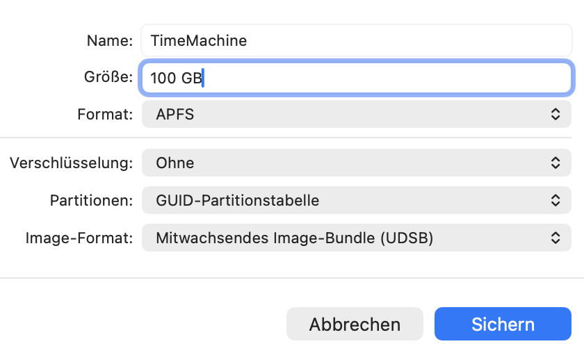

A step-by-step guide on how to configure Apple Time Machine to back up over an SMB network share using a sparse bundle virtual disk image.

<!--more-->

## 1. Create a Sparse Image (Virtual Disk)

There are two ways to create this virtual disk: via commands in the terminal, or using macOS Disk Utility.

### Option A: Using the Terminal

Navigate to the directory where you want to create the initial virtual disk (work locally first, not directly on the SMB share):

```bash
cd ~/Desktop
```

Run the following command to create a 500GB virtual disk image named `TimeMachine`. Adjust the size to suit your needs (roughly 1.5x to 2x your Mac's storage capacity is recommended):

```bash
hdiutil create -size 500g -type SPARSEBUNDLE -fs "HFS+J" TimeMachine.sparsebundle
```

### Option B: Using Disk Utility (GUI)

1. Open **Disk Utility**.
2. Click **File > New Image > Blank Image...** in the menu bar, or press `⌘ + N`.


3. Set **Image Format** to "sparse bundle disk image".
4. Set the desired maximum size (select the format first to prevent size reset errors).
5. Name the disk (e.g., `TimeMachine`) and optionally enable encryption.
6. Set the save location to your Desktop and click **Save**.



## 2. Copy the Image File to Your Network Share

Open Finder and navigate to the network SMB share you want to use for backups. Drag the `TimeMachine.sparsebundle` file you just created into this folder.

Once the copy has finished completely, you can delete the local copy from your Desktop. Now double-click the sparse bundle on your network share to mount it. You should see the mounted `TimeMachine` volume appear in Finder's sidebar.

## 3. Add the Image as a Destination for Time Machine

Because the macOS Time Machine settings UI typically does not allow directly selecting mounted network sparse bundles, register it as a destination via the terminal:

```bash
sudo tmutil setdestination /Volumes/TimeMachine
```

*(If you chose a different volume name, adjust `/Volumes/TimeMachine` accordingly.)*

## 4. Mount the Image Automatically on Login

Since macOS does not automatically remount network sparse bundles after a reboot, a small AppleScript app handles mounting on startup:

1. Open **Script Editor** (located in `/Applications/Utilities`).
2. Paste the following script, replacing the share path and image name with your actual values:

```applescript
tell application "Finder"
	try
		mount volume "smb://your-nas-ip-or-hostname/share-name"
		delay 5
		do shell script "hdiutil attach /Volumes/share-name/TimeMachine.sparsebundle"
	end try
end tell
```

3. Save the script as an **Application** (e.g. `MountTimeMachine.app`).
4. Go to **System Settings > General > Login Items** (or *System Preferences > Users & Groups > Login Items*) and add your new application to the list.

Now every time you log in, your Mac will automatically mount the backup image, allowing Time Machine to run without manual intervention.
